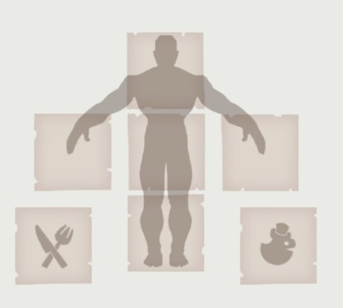

# Albion Build Randomizer



## Описание

**Albion Build Randomizer** — это кроссплатформенное Qt-приложение для организации и проведения случайных билд-роллов в игре Albion Online. Программа позволяет организаторам создавать пулы билдов, экспортировать их в виде хэша, а участникам — импортировать и случайным образом получать билды для игры.

- Удобный интерфейс для организаторов и игроков
- Гибкие настройки количества билдов на ролл
- Поддержка банов билдов
- Экспорт/импорт билдов через хэш
- Красивое отображение билдов с иконками

## Скриншоты


## Сборка

### Требования
- Qt 5.14+ (Widgets)
- CMake 3.16+
- Компилятор C++ с поддержкой C++17 (MinGW, MSVC, GCC, Clang)

### Инструкция

```bash
# Клонируйте репозиторий
 git clone https://github.com/yourusername/AlbionBuildRandomizer.git
 cd AlbionBuildRandomizer

# Создайте build директорию и соберите проект
 mkdir build
 cd build
 cmake ..
 cmake --build .
```

### Быстрый старт для Windows (MinGW)

```bash
# В каталоге проекта
 mkdir build
 cd build
 cmake -G "MinGW Makefiles" ..
 mingw32-make.exe
```

## Запуск

- После сборки запустите исполняемый файл `AlbionBuildRandomizer(.exe)` из папки `build`.

## Структура проекта

- `src/` — исходный код (основные виджеты, логика, UI)
- `images/` — ассеты и иконки для билдов
- `resources.qrc` — Qt-ресурсы
- `CMakeLists.txt` — сборочный скрипт
- `build/` — временная папка для сборки (игнорируется в git)

## Игнорируемые файлы

В проекте уже настроен `.gitignore` для исключения временных, бинарных и IDE-файлов.

## Лицензия

MIT License (или укажите свою)

---

**Разработчик:** [Сheezerok](https://github.com/Cheezerok) 
